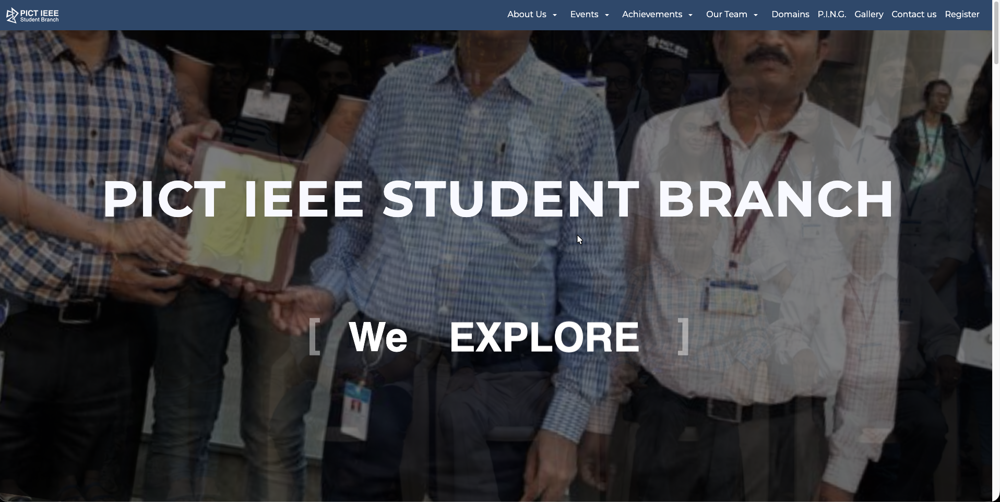
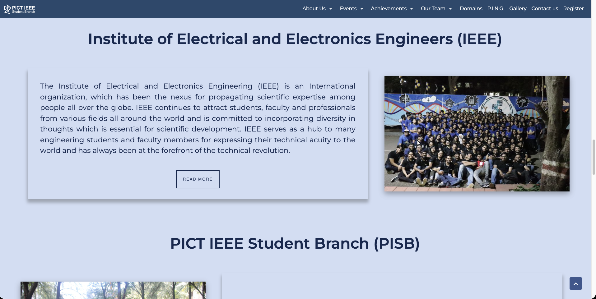
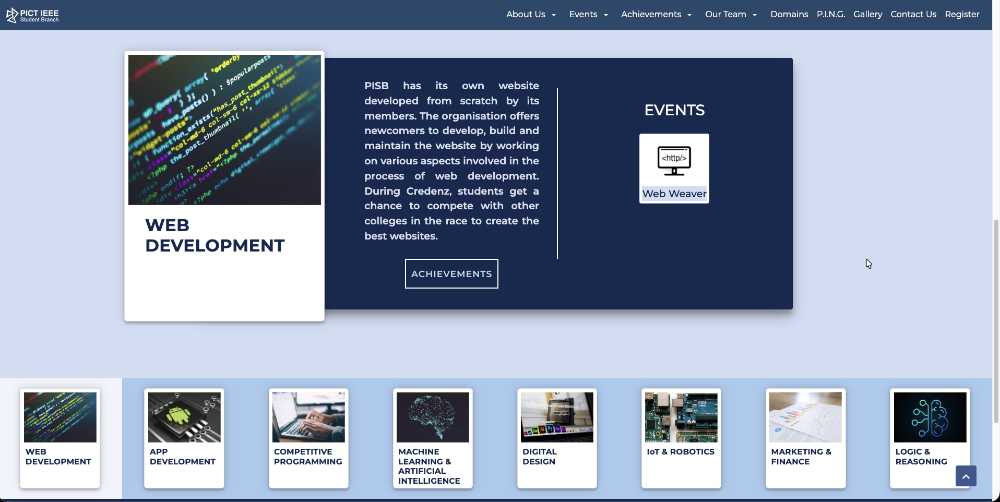
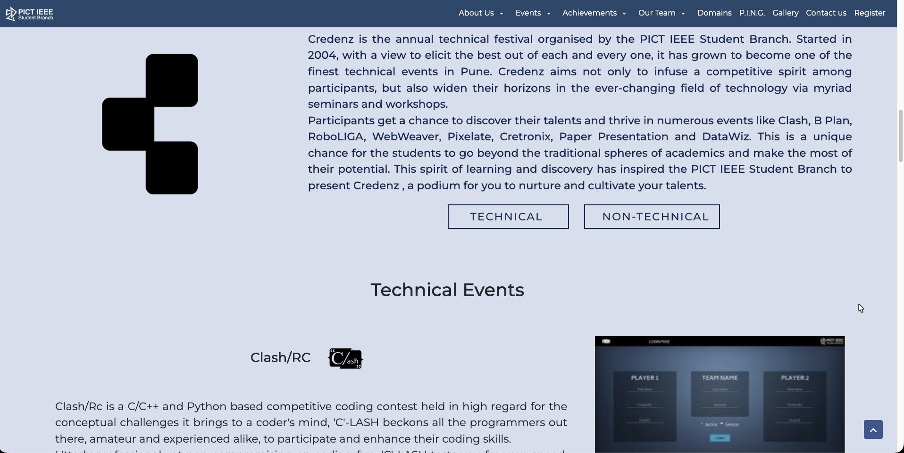
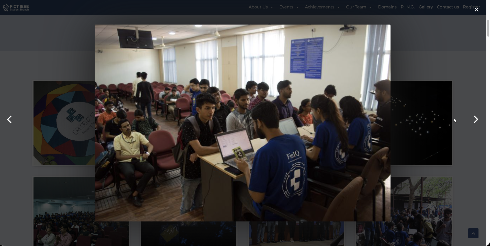
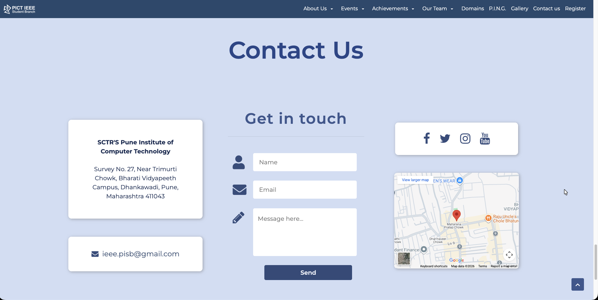
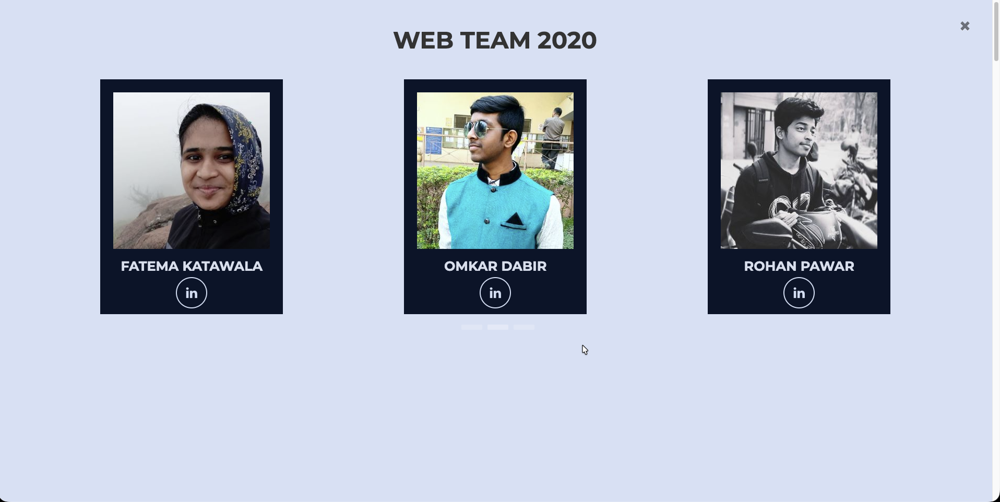

# 🌐 PISB Website  
*Official Website of PICT IEEE Student Branch*

This project is the **official website of the PICT IEEE Student Branch (PISB)**, built collaboratively as a **team project during college**.  
The website serves as a central digital presence for the student club, showcasing its **vision, domains, events, activities, and contact information**.

The project was intentionally developed as a **purely static website** using **HTML, CSS, and JavaScript**, and deployed on **GoDaddy using cPanel**, reflecting real-world constraints and learning during early-stage web development.

---

## 🌐 Live Demo

🔗 https://pictieee.in/ 

or
🔗 https://rakmo33.github.io/PISB-Website/

> Hosted using **GoDaddy cPanel** (original deployment).

<video src="[./assets/demo.mov](https://github.com/Rakmo33/PISB-Website/blob/master/assets/demo.mov)" autoplay loop muted width="100%"></video>

---

## 🤝 Team Collaboration

- Built as a **team effort** under PICT IEEE Student Branch  
- Collaborated with designers, content writers, and developers  
- Followed structured handoffs and peer reviews  
- Learned real-world coordination beyond solo projects  

---

## 🛠️ Tech Stack

| Technology | Role |
|-----------|------|
| HTML5 | Page structure & semantics |
| CSS3 and AOS | Styling & animations |
| JavaScript | Interactivity & DOM manipulation |
| GoDaddy cPanel | Hosting & deployment |
| Git & GitHub | Version control & collaboration |

---

## ✨ Highlights

- 🌐 Fully responsive, multi-page static website  
- 📄 Clean and structured informational layout  
- 🚀 Deployed on production hosting via cPanel  
- 🏫 Built for an official student organization  

---

## 📂 Website Sections

**Home** – Introduction to PISB and its vision  

**About Us** – Overview of IEEE and PISB  

**Domains** – Technical and non-technical domains  

**Events** – Past and upcoming activities  

**Gallery** – Event photos and highlights  

**Contact Us** – Contact details and inquiry form  

**Our Team** – Web Team 

---

## 📚 Key Learnings

### 🔁 Maintainability Challenges
- Repetitive HTML across multiple pages  
- Manual updates required for shared components (navbar, footer)  
- High effort to maintain consistency  

### 🧠 Realization of Framework Needs
- Felt the strong need for **component-based frameworks**  
- Understood the value of reusability and modularity  
- Appreciated templating, routing, and state management  

### ⚠️ Limitations of Pure Static Approach
- No build pipeline or optimization  
- Limited scalability for feature additions  
- Difficult collaboration as the codebase grows  

> This project became a **turning point** that motivated the transition to modern frameworks like **React and Angular**.

---

## ⭐ Acknowledgements

Built by the **PISB Web Team** during undergraduate studies at **PICT, Pune**.  
Special thanks to PISB seniors and coordinators for guidance and feedback.
